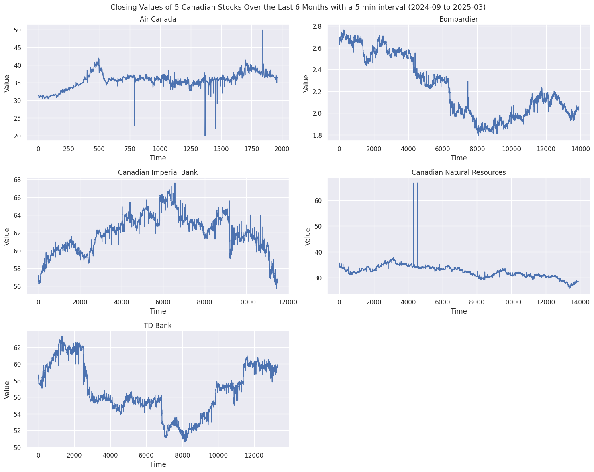
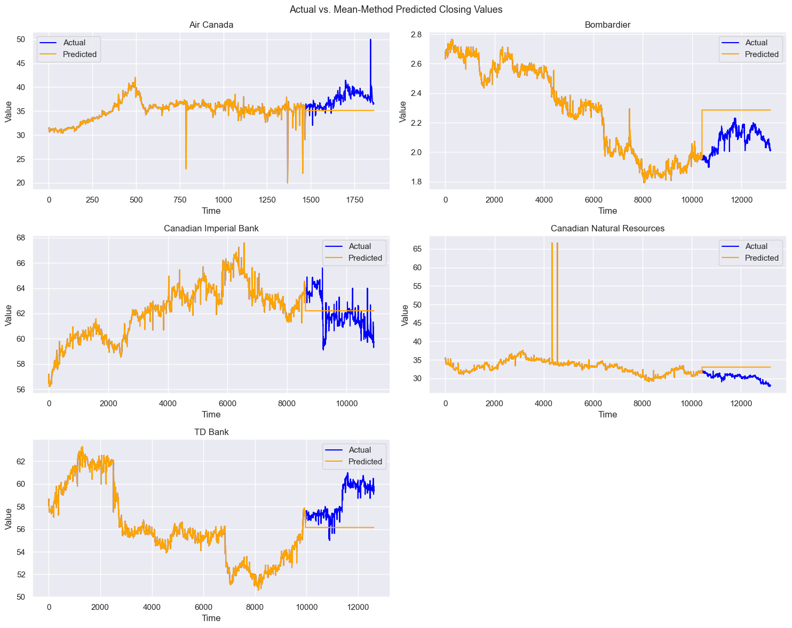
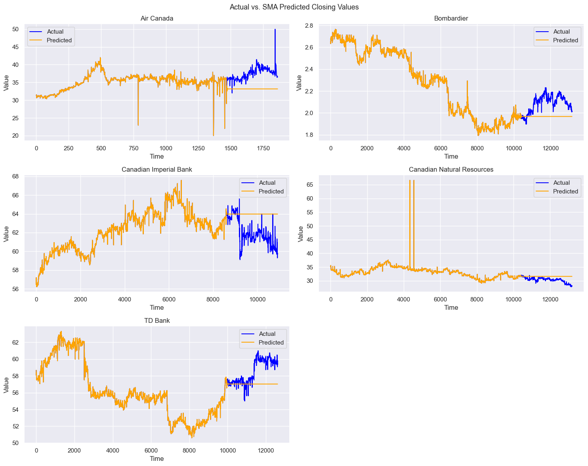
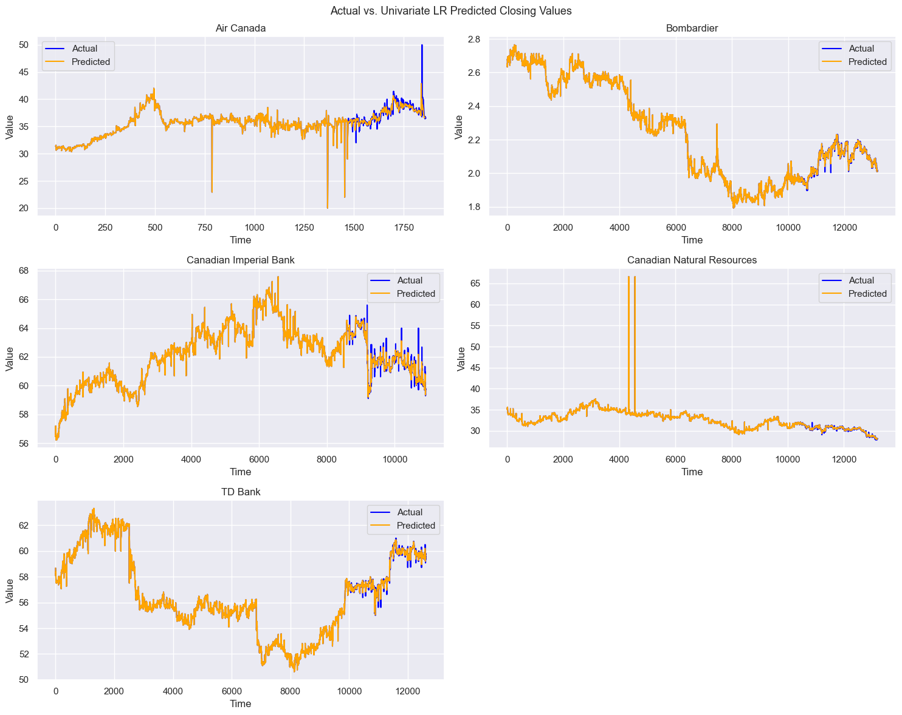
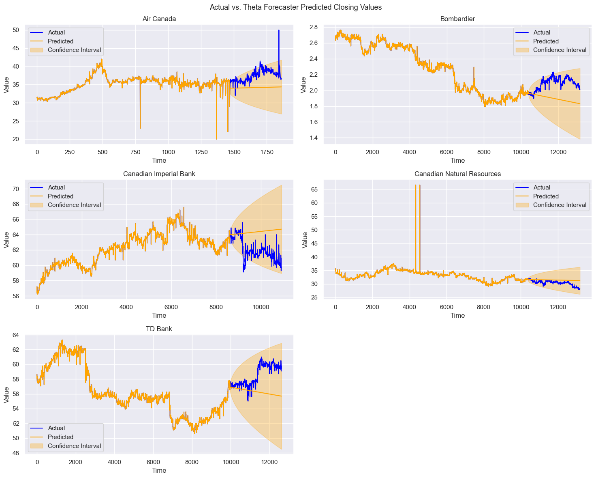
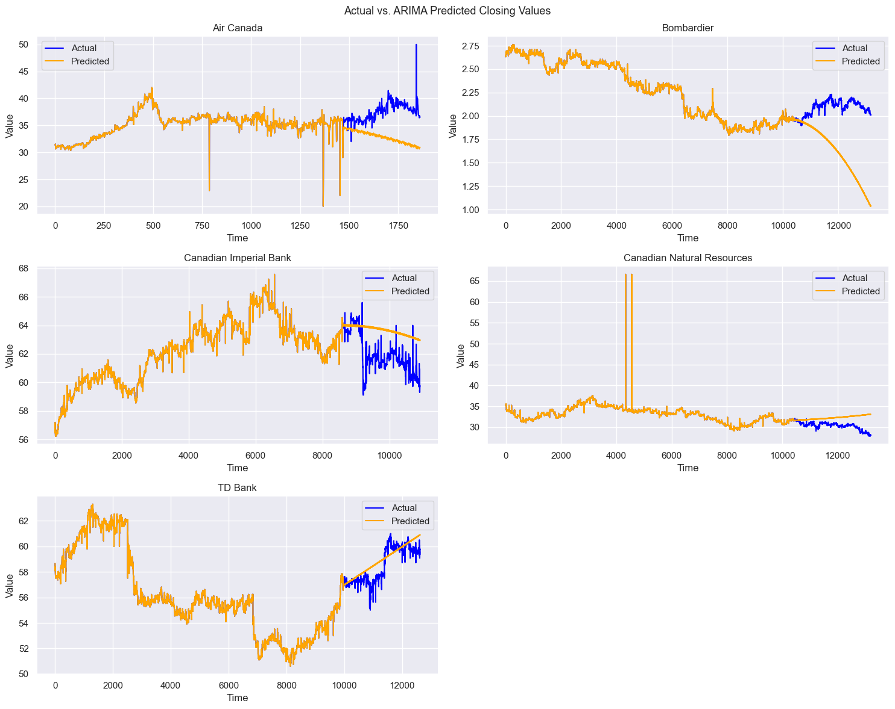
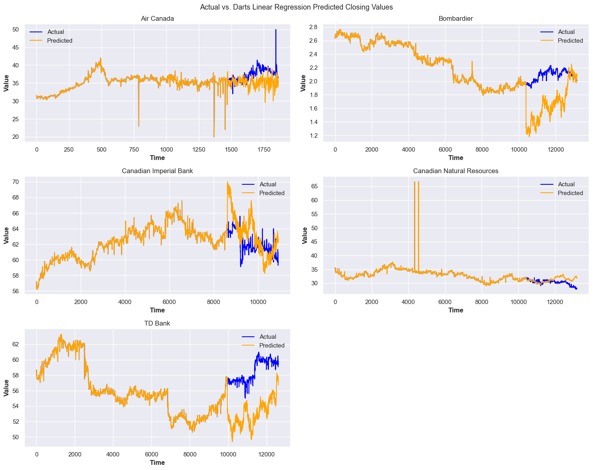
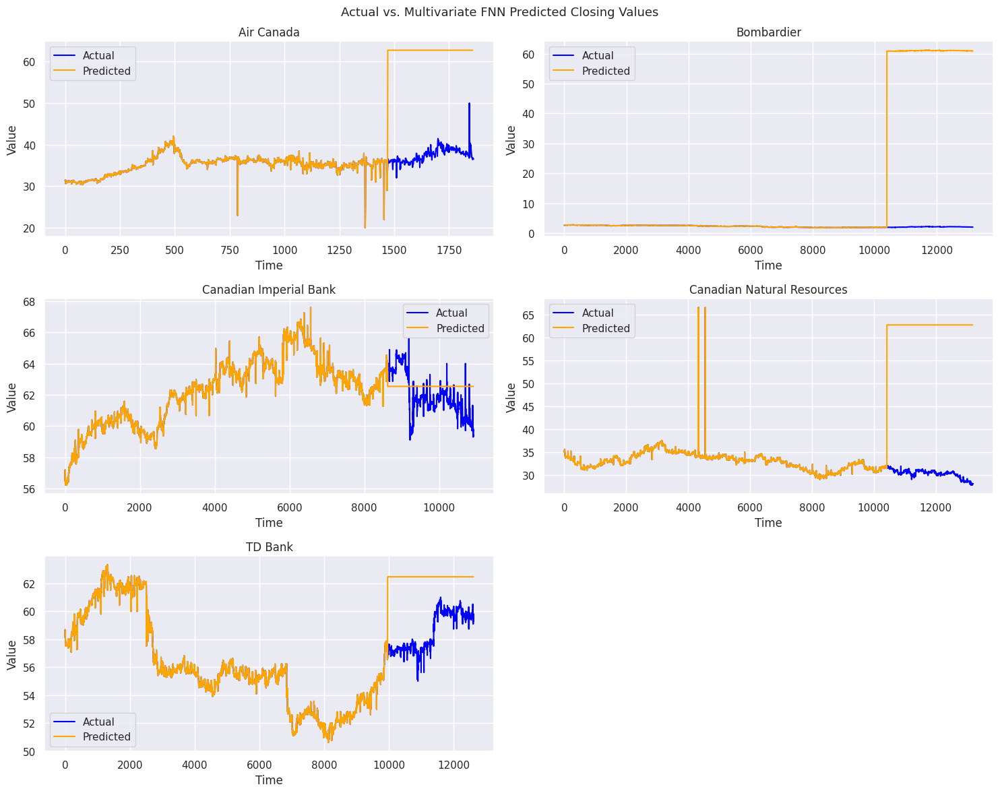
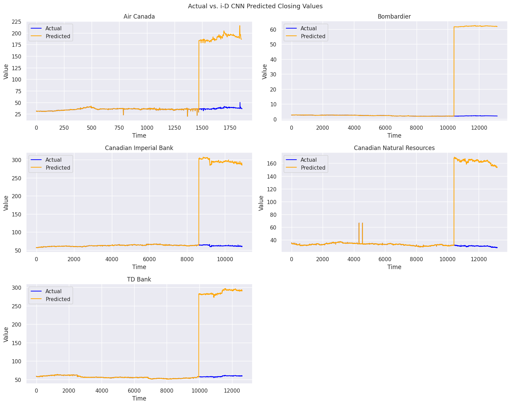
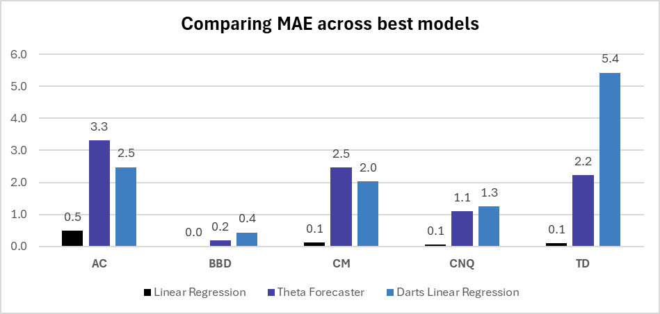

# Predictive-Modeling-of-Canadian-Stock-Prices
The project focuses on predictive modeling of Canadian stock prices using historical market data and machine learning techniques. It aims to forecast future stock trends and support data-driven investment decisions through exploratory analysis and model evaluation.

## Project Overview
This repository contains an end-to-end solution for financial data analysis and price prediction, featuring:

1. **Data Generation Pipeline**: Automated collection of intraday stock data
2. **Multi-Model Analysis**: Comparative study of 10 machine learning approaches
3. **Visual Analytics**: Interactive visual comparisons of model performance

## Technical Requirements

### 1. Python Libraries

```python
matplotlib==3.9.4
numpy==1.26.4
pandas==2.2.3
scikit-learn==1.6.1
sktime==0.36.0
tensorflow==2.18.0
tqdm==4.67.1
```

### 2. API Setup

- Get free API key from [Alpha Vantage](https://www.alphavantage.co/support/#api-key)
- Replace Place Holder in  data_generator.ipynb:
```python
def data_gen_from_api(..., api = "YOUR_API_KEY_HERE")
```

## Key Components

### 1. Data Generator 
**Features:**
- Alpha Vantage API integration with parameterized requests
- Multi-symbol processing (5 major stocks)
    - AC - Air Canada
    - BBD.B - Bombardier Inc Class B
    - CM - Canadian Imperial Bank of Commerce
    - CNQ - Canadian Natural Resources Ltd
    - TD - Toronto-Dominion Bank
- Temporal coverage: 09/2024 - 03/2025 (simulated future data)
- Data validation and cleaning pipeline
- CSV export with standardized format

**Sample Output:**

| date                 | open   | high   | low    | close  | volume |
|----------------------|--------|--------|--------|--------|--------|
| 2024-09-03 09:30:00  | 31.376 | 31.376 | 31.376 | 31.376 | 101    |
| 2024-09-03 10:45:00  | 31.386 | 31.386 | 31.386 | 31.386 | 209    |



### 2. Predictive Analytics
**Implemented Models**

1. Mean Method



2. Naive Method


3. Simple Moving Average

 

4. Exponential Weighted Moving Average

 

5. Univariate Linear Regression Model

 

6. Theta Forecaster

 

7. ARIMA

 

8. Darts Linear Regression Model

 

9. Multivariate FFNN

 

10. 1-D CNN

 

## Key Insights

**Top Performing Models**


